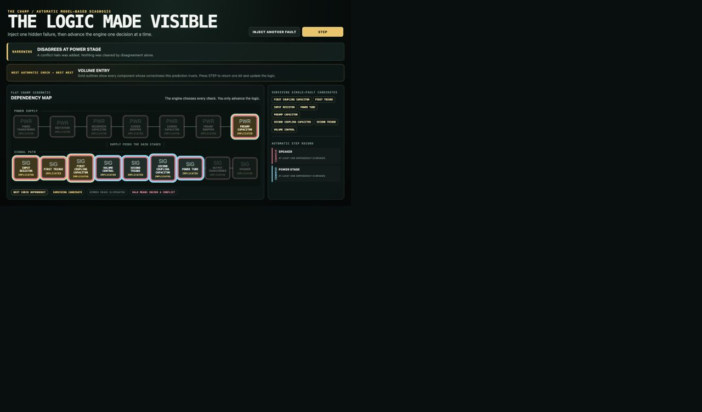

# Epistemic Microworlds: the logic of troubleshooting

An interactive, de Kleer/Reiter-inspired model-based diagnosis demo. Inject a hidden fault, then watch the engine choose measurements and narrow competing explanations. When the available measurements cannot distinguish two candidates, it reports ambiguity instead of guessing.



## Try it locally

Use Node.js 22.12+ (Node 24 LTS recommended).

```sh
npm ci
npm run dev
```

Open http://127.0.0.1:5310/. Inject a fault, then press **STEP** to follow each diagnostic decision.

## What is implemented

- A qualitative dependency model with 16 functional components and 15 one-bit probes.
- Conflict sets and inclusion-minimal hitting sets for candidate diagnosis.
- Probe selection that partitions the remaining single-fault candidates.
- Visible measurement dependencies, observation history and explicit unresolved outcomes.
- A hidden-fault oracle kept separate from the diagnostic engine.

The conceptual foundation is model-based diagnosis, not a trained model guessing a fault label. See [attribution](ATTRIBUTION.md).

## Verify

```sh
npm test
npm run audit
npm run build
```

The historical audit reported **3,600 resolved, 496 correctly ambiguous, zero wrong** in 4,096 seeded single-fault trials. These are repeated draws from the 16-component model, not 4,096 different circuits. Publication checks are recorded in [VALIDATION.md](VALIDATION.md).

## Scope and limitations

This is a teaching instrument: measurements are qualitative AGREES/DISAGREES bits derived from a declared dependency model. It does not simulate real amplifier voltages or validate diagnosis against hardware. The single-fault assumption and dependency model constrain what conclusions are justified. The original [technical report](docs/DX-2-DEFENSIVE-REPORT.md) preserves detailed audit context; its local dependency setup is historical, superseded here by a standalone lockfile.

## Project role

Peter Murphy: project conception, technical direction, requirements and acceptance review, informed by avionics troubleshooting experience. Implementation and iterative review used AI coding assistants. This repository is a clean portfolio snapshot; see [publication notes](PUBLICATION.md).
